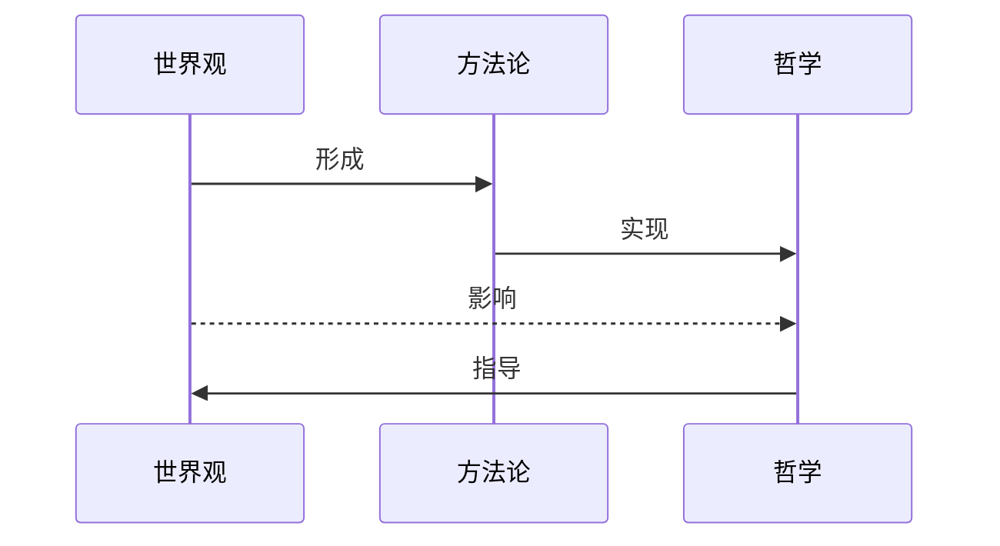

### 哲学、世界观、方法论

- **哲学**：哲学是世界观的表现形态，也是世界观和方法论的统一
- **世界观**：**人**对**世界**及**人与世界**的根本观点和看法
- **方法论**：认识世界和改造世界的理论，哲学为最高层的方法论
  

```mermaid
sequenceDiagram
    participant 世界观
    participant 方法论
    participant 哲学

    世界观->>方法论: 形成
    方法论->>哲学: 实现
    世界观-->>哲学: 影响
    哲学->>世界观: 指导

```
