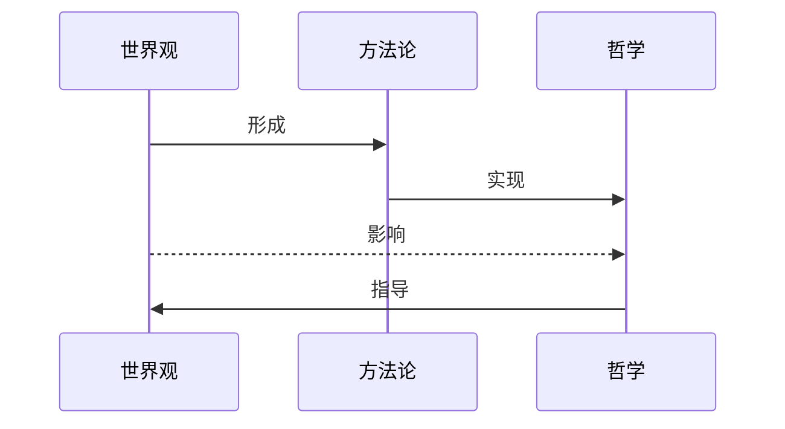

# 马哲原理

1. 哲学、世界观和方法论的关系：
   - **哲学**：哲学是世界观的表现形态，也是世界观和方法论的统一
   - **世界观**：**人**对**世界**及**人与世界**的根本观点和看法
   - **方法论**：认识世界和改造世界的理论，哲学为最高层的方法论
  

---
2. 基本问题：
   1. **意识**和**物质**:
      1. 谁决定谁？
      2. 是否存在同一性？即思维（意识）能否反映存在（物质）？
---
3. 哲学主要（基本）问题是**意识**和**物质**之间的关系：
   1. 必须解决
   2. 如何解决？是解决其他哲学问题的基础
   3. 不同的解决方式诞生出不同的哲学基本派别
      1. **唯物主义**：物质决定意识
      2. **维心主义**：意识决定物质
   4. 也是人们社会实践的基本问题
---
4. 可知论和不可知论
   1. 取决与哲学基本问题的第二方面
   2. 可知论：承认客观世界能被人们所认识
   3. 不可知论：否认客观世界能被人们所认识
---
5. 辩证法和形而上学的区别
   1. 辩证法：
      1. 永恒的运动
      2. 量变和质变（渐变和突变）
      3. 变化源于矛盾
   2. 形而上学：
      1. 孤立和静止
      2. 否认质变和飞跃
      3. 变化源于外力
   3. 两者从属于唯心和唯物，而非两种独立的哲学派别
---
6. 唯物主义哲学的三个基本阶段或历史形态
   1. 古代唯物主义：
      1. 肯定世界物质的统一性
      2. 世界由原初物质所构成
   2. 形而上学唯物主义：
      1. 世界由原子构成
   3. 现在辩证唯物主义和历史唯物主义：
      1. 唯一的科学完备的唯物主义
---
7. 唯心主义基本形式
   1. 客观唯心主义：
      1. 物质世界是某种**客观精神**的产物和表现
   2. 主观唯心主义：
      1. 物质世界是**个人精神**的产物和表现
---
8. 马哲的产生
   1. 是当时社会发展的产物
   2. 是 19 世纪自然科学发展的必然结果，三大科学发现为马哲提供了产生的基础：
      1. 能量守恒和转化定律
      2. 细胞学说
      3. 生物进化论
   3. 是人类思想上一切优秀成果的继承，是合乎逻辑的发展成就，马哲理论源于
      1. 黑格尔辩证法的“合理内核”
      2. 费尔巴哈唯物主义的“基本内核”
---
9.  马哲是哲学史上一次变革，主要体现在以下三点：
    1.  解决了哲学和具体科学的关系。以哲学为基础，具体科学为指导。
    2.  克服了唯物主义和辩证法相脱离，自燃观和历史观不一致状况
    3.  属于无产阶级的哲学
--- 
10. 马哲基本特征
    1.  实践性
    2.  阶级性
    3.  科学性
    4.  创新性
---
11. 马哲是认识世界和改造世界的伟大工具
    1.  马哲对社会发展有重要作用
        1.  无产阶级解放自身和人类的理论武器和精神支柱
        2.  中国特色社会主义的哲学基础
    2.  马哲对人生有重要作用
        1.  树立正确的世界观、人生观、价值观
        2.  提高个人思想和精神修养
        3.  提高个人理论思维水平
---
12. 马哲在建设中国特色社会主义中的指导作用
    1.  是无产阶级制定战略策略的理论基础，是中国特色社会主义建设理论指南
    2. 增强我们鉴别各种理论和线路是非的能力
    3. 掌握运用概念艺术、提高理论思维能力  